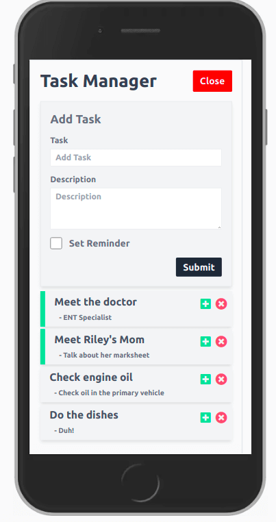

#  Vite + Vuejs + Tailwindcss (JIT) + Vue-Router + JSONServer Trial Todo App

*This app is a trial of the below frontend stack*
- Vite - Vite is more compatible with tailwindcss(JIT) than vue-cli
- Tailwindcss - unopinionated, clean, efficient (JIT 🚀) 
- Vuejs
- Vue-Router
- JSONServer - Fake REST API using just a JSON file

